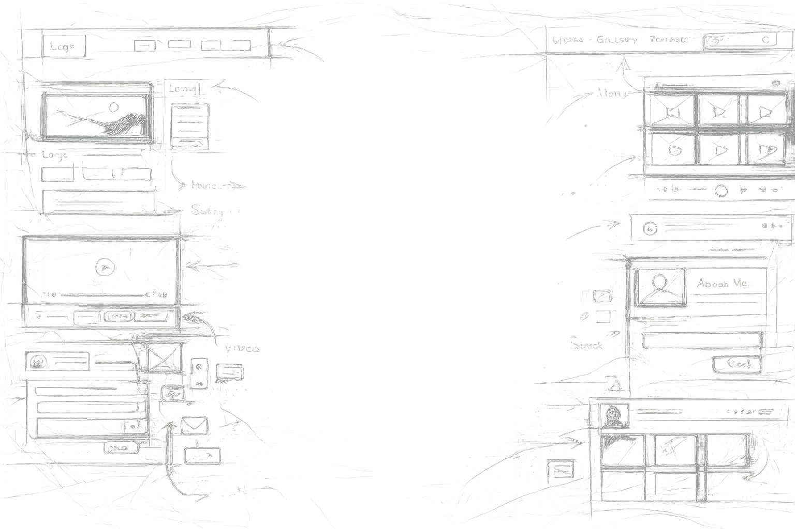

# Palo



**A minimalist Astro theme for creative portfolios.**  
**为创作者作品集而生的极简 Astro 主题。**

Palo is built for artists, musicians, designers, photographers, makers, and independent studios who want a personal site that feels designed without becoming hard to maintain. It combines a portfolio, blog, content-driven documentation, accessible UI patterns, dark mode, image workflows, and a single YAML configuration file for global visual control.

Palo 面向艺术家、音乐人、设计师、摄影师和独立工作室。它把作品集、博客、内容文档、无障碍 UI、深色模式、图片工作流和统一配置整合在一起，让网站既有设计感，也容易维护。

[Live demo](https://palo.petepa.com/) · [Astro](https://astro.build/) · [Accessible Astro Components](https://github.com/incluud/accessible-astro-components)

---

## Why Palo

Most portfolio themes make your work fit the template. Palo gives you a small design system that can move around the work.

多数作品集模板会让作品迁就模板；Palo 更像一套围绕作品移动的设计系统。

- **One config file for the visual system**  
  Control site metadata, branding, color tokens, typography, navigation, borders, radius, portfolio lists, blog lists, component defaults, and contact settings from `src/config.yaml`.

- **Portfolio-first content structure**  
  Projects are content collections with cover images, tags, project types, featured ordering, external links, live demos, videos, and detail pages.

- **Blog and documentation built in**  
  Use posts for writing, tutorials, release notes, component docs, or project process notes. Tag pages, pagination, latest-post sections, share links, and table of contents are included.

- **Co-located image workflow**  
  Keep images next to Markdown or MDX files and reference them with `./cover.jpg` or `./sample.jpg`. Palo handles the public mirror needed for dev/build and routes optimized images through Astro where possible.

- **Immersive layout components**  
  Hero, CreativeSection, PaloPageHeader, PostHeader, BreakoutImage, Slogan, FeaturedProjects, LatestPosts, and cards are ready to compose pages without starting from blank CSS.

- **Accessibility as a foundation**  
  Palo builds on `accessible-astro-components`, semantic HTML, keyboard-friendly navigation, visible focus states, color contrast tooling, and `prefers-reduced-motion`-aware patterns.

- **Contact form ready for production**  
  Customize fields and options, then send email through Resend with deployment environment variables.

---

## Quick Start

Requires Node.js `>=22.12.0`.

```bash
npm install
npm run dev
```

The dev server starts at:

```text
http://localhost:4321
```

Build for production:

```bash
npm run build
npm run preview
```

---

## What You Can Customize

Palo is intentionally config-driven. Start with [src/config.yaml](src/config.yaml).

| Area | What it controls |
| --- | --- |
| `site` | Site name, trailing slash behavior, theme mode, launcher, back-to-top, custom cursor |
| `metadata` | SEO title, description, author, social preview image, favicon |
| `branding` | Logos, text logo, color palette, font family, font weights |
| `navigation` | Fixed header, dropdown style, mobile menu, active link style, nav spacing |
| `typography` | Base size, heading scale, line height, uppercase display text |
| `border` / `radius` | Global and component-level border/radius tokens |
| `components` | Defaults for page headers and post/project headers |
| `portfolio` | Pagination, layout mode, masonry width, columns, tags, featured projects |
| `blog` | Pagination, tags, stats, post card spacing, latest posts |
| `contact` | Recipient email, Resend sender, local development API key fallback |

中文提示：大多数视觉和内容列表行为都集中在 `src/config.yaml`，不需要先改一堆组件文件。

---

## Content Model

### Blog posts

Posts live in `src/content/posts/`.

```text
src/content/posts/
└── 20260611-my-post/
    ├── index.mdx
    ├── cover.jpg
    └── sample.jpg
```

Typical frontmatter:

```yaml
title: "My Post"
description: "A short summary for cards and SEO."
publishDate: 2026-06-11
author: "Your Name"
tags: ["Documentation", "Design"]
coverImage: ./cover.jpg
draft: false
```

### Portfolio projects

Projects live in `src/content/projects/`.

```text
src/content/projects/
└── project-01/
    ├── index.mdx
    └── cover.jpg
```

Projects support type filters, tags, featured ordering, source links, live demos, external links, and video metadata.

中文提示：文章和项目都推荐使用“一个内容一个文件夹”的结构，图片放在内容旁边，迁移和维护更稳。

---

## Image Workflow

Palo prefers co-located assets:

```mdx
---
coverImage: ./cover.jpg
---


```

For wider editorial layouts, use `BreakoutImage` in MDX:

```mdx
import BreakoutImage from '@components/BreakoutImage.astro'

<BreakoutImage src="./wide-image.jpg" alt="Gallery installation view" mode="full" />
```

Generated public mirrors under `public/posts/{slug}/` and `public/projects/{slug}/` are ignored by Git. Commit the original files under `src/content/...`. If you manually add static files to `public/posts` or `public/projects`, place them at the root level, not inside slug subdirectories.

中文提示：自动生成的 public 子目录不要提交；手动 public 文件请放在 `public/posts/` 或 `public/projects/` 根目录。

---

## Built-In Pages

| Route | Purpose |
| --- | --- |
| `/` | Homepage with hero, feature summary, featured projects, latest posts |
| `/blog` | Paginated post index with tag filtering |
| `/blog/[post]` | Post detail pages with cover, author, TOC, share links |
| `/portfolio` | Project index with configurable masonry/grid layout |
| `/portfolio/[project]` | Project detail pages |
| `/portfolio/type/[type]` | Project type archive |
| `/portfolio/tag/[tag]` | Project tag archive |
| `/contact` | Configurable contact form with Resend support |
| `/accessible-components` | Component showcase |
| `/accessible-launcher` | Launcher demo |
| `/color-contrast-checker` | WCAG contrast utility |
| `/sitemap` | Human-readable sitemap |

---

## Key Components

| Component | Use it for |
| --- | --- |
| `Hero` | Homepage hero with image/video background, alignment, overlay, divider |
| `CreativeSection` | Reusable immersive section with media background and content slot |
| `PaloPageHeader` | List pages, static pages, MDX page headers |
| `PostHeader` | Blog and project detail headers with cover, breadcrumbs, author, links |
| `BreakoutImage` | Full, wide, and contained image layouts inside MDX |
| `FeaturedProjects` | Config-aware project highlights |
| `LatestPosts` | Config-aware latest post section |
| `Slogan` | Static, fit-to-width, or marquee brand text |
| `Navigation` | Responsive navigation with dropdowns, launcher, and dark mode |

中文提示：这些组件对应 demo site 里的功能文章，可以直接从现有页面复制用法。

---

## Project Structure

```text
src/
├── config.yaml              # Main site and design configuration
├── navigation.ts            # Main navigation and social links
├── contactForm.ts           # Contact form fields and options
├── content/
│   ├── posts/               # Blog posts and docs
│   └── projects/            # Portfolio projects
├── components/              # Palo-specific Astro components
├── layouts/                 # Default and Markdown layouts
├── pages/                   # File-based routes
├── assets/scss/             # Global styles and component styles
└── utils/                   # Content, image, config, and routing helpers

public/
├── branding/                # Logos, preview images, favicon
├── fonts/                   # Local font files
├── posts/                   # Manual root files only; generated subdirs are ignored
└── projects/                # Manual root files only; generated subdirs are ignored
```

---

## Documentation Inside This Starter

Palo ships with long-form posts that explain how the theme works. Useful starting points:

| Guide | File |
| --- | --- |
| Configuration reference | [Config Everything You Like](src/content/posts/20260603-config-everything-you-like/index.md) |
| Asset co-location | [Asset Co-Location Guide](src/content/posts/20260611-asset-co-location-guide/index.mdx) |
| Blog list and latest posts | [Blog List and LatestPosts Component](src/content/posts/20260607-blog-list-and-latestposts-component/index.md) |
| Portfolio list and featured projects | [Projects List and FeaturedProjects Component](src/content/posts/20260607-projects-list-and-featuredprojects-component/index.md) |
| Hero component | [Hero Component](src/content/posts/20260607-hero-component/index.md) |
| Creative sections | [CreativeSection Component](src/content/posts/20260608-creativesection-component/index.md) |
| Page headers | [PaloPageHeader Component](src/content/posts/20260608-palo-page-header-component/index.md) |
| Detail headers | [PostHeader Component](src/content/posts/20260603-postheader-component/index.md) |
| Navigation | [Navigation Configuration](src/content/posts/20260609-navigation-configuration/index.md) |
| Icons | [Phosphor Icons Guide](src/content/posts/20260609-phosphor-icons-guide/index.mdx) |
| Contact form | [Contact Form Setup and Resend Integration](src/content/posts/20260814-contact-form-setup/index.md) |

中文提示：这些文章既是网站内容示例，也是主题使用文档。开源后用户可以在本地站点中直接阅读。

---

## Deployment

Palo builds as a static Astro site and currently includes the Vercel adapter. It can be deployed to Vercel, Netlify, Cloudflare Pages, GitHub Pages, or any static hosting provider that supports Astro output.

```bash
npm run build
```

Production output is generated in `dist/`.

For contact forms, set your Resend key through deployment environment variables:

```text
RESEND_API_KEY=...
```

Do not commit production secrets to `src/config.yaml`.

---

## Accessibility

Palo inherits the accessibility-first approach of Accessible Astro and adds theme-level patterns around focus states, keyboard navigation, color contrast, reduced motion, semantic content structure, and readable typography.

Accessibility is not a decorative feature here. It is part of the foundation.

中文提示：Palo 的目标不是“看起来像无障碍”，而是把键盘、语义、对比度和可读性放进默认体验里。

---

## Credits

Palo is based on the Accessible Astro ecosystem and extends it into a creative portfolio theme.

- [Astro](https://astro.build/)
- [Accessible Astro Components](https://github.com/incluud/accessible-astro-components)
- [Tailwind CSS](https://tailwindcss.com/)
- [Phosphor Icons](https://phosphoricons.com/)
- [Resend](https://resend.com/)

---

## License

MIT.

Made for people who make things.  
为创作者而做。
