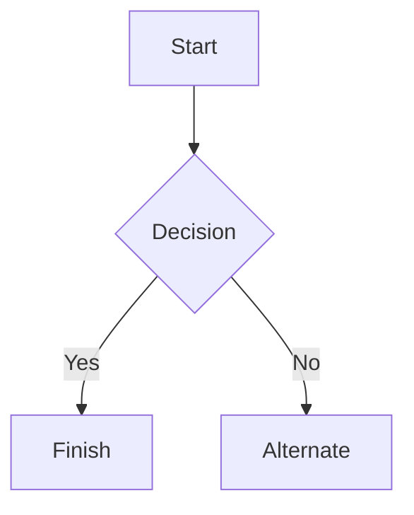

## Headers

# This is a Heading h1
## This is a Heading h2
###### This is a Heading h6

```markdown
# This is a Heading h1
## This is a Heading h2
###### This is a Heading h6
```

---

## Emphasis

*This text will be italic*  
_This will also be italic_

**This text will be bold**  
__This will also be bold__

_You **can** combine them_

```markdown
*This text will be italic*  
_This will also be italic_

**This text will be bold**  
__This will also be bold__

_You **can** combine them_
```

Due to the rendering mechanics of web fonts, Markdown italic syntax (*text* or _text_) may not display correctly if the active typeface lacks an italic variant. For optimal typographic rendering, please ensure your configuration loads a font family that fully supports italic styles.

由于网站字体的渲染机制，如果当前启用的字体系列不包含斜体字形，Markdown 的斜体语法（*文本* 或 _文本_）可能无法正常显示。为了获得最佳的排版视觉效果，请确保在配置中加载了完整支持斜体样式的字体。

---

## Lists

### Unordered

* Item 1
* Item 2
* Item 2a
* Item 2b
    * Item 3a
    * Item 3b

```markdown
* Item 1
* Item 2
* Item 2a
* Item 2b
    * Item 3a
    * Item 3b
```

### Ordered

1. Item 1
2. Item 2
3. Item 3
    1. Item 3a
    2. Item 3b

```markdown
1. Item 1
2. Item 2
3. Item 3
    1. Item 3a
    2. Item 3b
```

---

## Images


```markdown

```

---

## Links

You may be using [Markdown Live Preview](https://markdownlivepreview.com/).

```markdown
You may be using [Markdown Live Preview](https://markdownlivepreview.com/).
```

---

## Blockquotes

> Markdown is a lightweight markup language with plain-text-formatting syntax, created in 2004 by John Gruber with Aaron Swartz.
>
>> Markdown is often used to format readme files, for writing messages in online discussion forums, and to create rich text using a plain text editor.

```markdown
> Markdown is a lightweight markup language with plain-text-formatting syntax, created in 2004 by John Gruber with Aaron Swartz.
>
>> Markdown is often used to format readme files, for writing messages in online discussion forums, and to create rich text using a plain text editor.
```

---

## Tables

| Left columns  | Right columns |
| ------------- |:-------------:|
| left foo      | right foo     |
| left bar      | right bar     |
| left baz      | right baz     |

```markdown
| Left columns  | Right columns |
| ------------- |:-------------:|
| left foo      | right foo     |
| left bar      | right bar     |
| left baz      | right baz     |
```

---

## Blocks of code

```
let message = 'Hello world';
alert(message);
```

````markdown
```
let message = 'Hello world';
alert(message);
```
````

---

## Mermaid diagrams



````markdown

````

---

## Inline code

This web site is using `markedjs/marked`.

```markdown
This web site is using `markedjs/marked`.
```