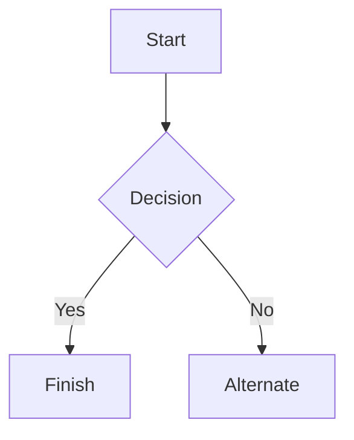

### Headers

# This is a Heading h1
## This is a Heading h2
###### This is a Heading h6

### Emphasis

*This text will be italic*  
_This will also be italic_

**This text will be bold**  
__This will also be bold__

_You **can** combine them_

### Lists

#### Unordered

* Item 1
* Item 2
* Item 2a
* Item 2b
    * Item 3a
    * Item 3b

#### Ordered

1. Item 1
2. Item 2
3. Item 3
    1. Item 3a
    2. Item 3b

### Images


### Links

You may be using [Markdown Live Preview](https://markdownlivepreview.com/).

### Blockquotes

> Markdown is a lightweight markup language with plain-text-formatting syntax, created in 2004 by John Gruber with Aaron Swartz.
>
>> Markdown is often used to format readme files, for writing messages in online discussion forums, and to create rich text using a plain text editor.

### Tables

| Left columns  | Right columns |
| ------------- |:-------------:|
| left foo      | right foo     |
| left bar      | right bar     |
| left baz      | right baz     |

### Blocks of code

```
let message = 'Hello world';
alert(message);
```

### Mermaid diagrams


### Inline code

This web site is using `markedjs/marked`.


import { Icon } from 'astro-icon/components'
import { Notification } from 'accessible-astro-components'

<Notification type="info">
  <Icon aria-hidden="true" name="ph:info" size="32" />
  <p>
    <strong>Info:</strong> This page utilizes Astro's MDX feature which let's you use components in a markdown file and
    supports out-of-the-box syntax highlighting with Shiki.
  </p>
</Notification>

Lorem ipsum dolor sit amet consectetur adipisicing elit. Vitae veniam repellat deleniti obcaecati facilis non, praesentium aperiam laudantium excepturi assumenda doloremque animi quis aliquam eligendi quia nemo asperiores et eaque, sunt voluptatibus, saepe exercitationem id. Quis sequi maxime fugiat nam reprehenderit nesciunt quaerat obcaecati, ipsa dignissimos voluptatum voluptatem, optio quidem quos repudiandae dolorem voluptatibus fuga officia odio nemo recusandae voluptas.

```js
console.log('Hello Accessible World!')
```

Lorem ipsum dolor sit amet consectetur adipisicing elit. Vitae veniam repellat deleniti obcaecati facilis non, praesentium aperiam laudantium excepturi assumenda doloremque animi quis aliquam eligendi quia nemo asperiores et eaque, sunt voluptatibus, saepe exercitationem id. Quis sequi maxime fugiat nam reprehenderit nesciunt quaerat obcaecati, ipsa dignissimos voluptatum voluptatem, optio quidem quos repudiandae dolorem voluptatibus fuga officia odio nemo recusandae voluptas.

[Get this theme on GitHub](https://github.com/markteekman/accessible-astro-starter)
